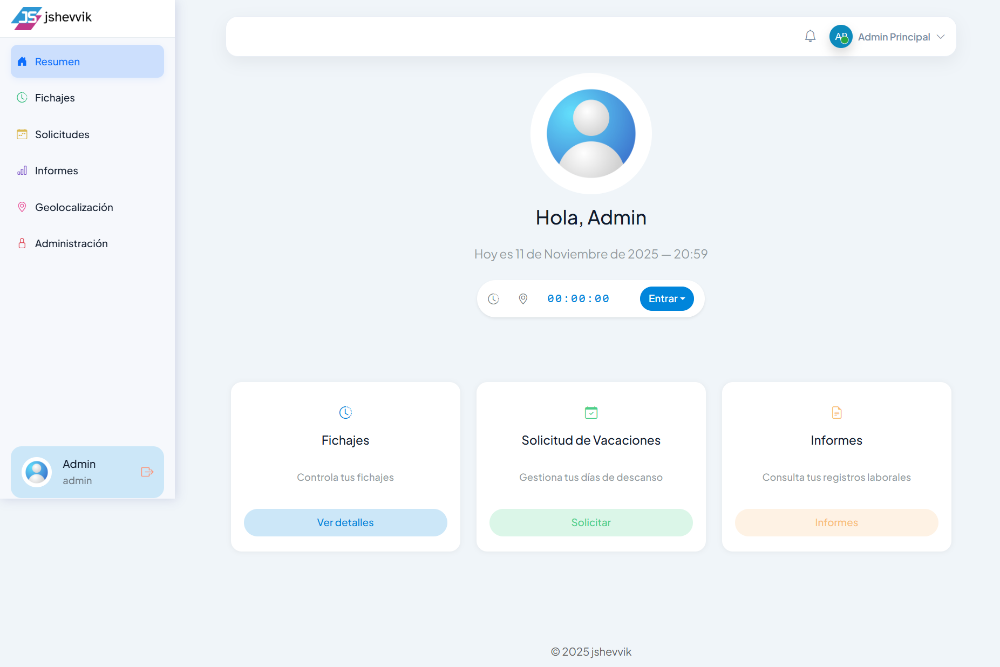
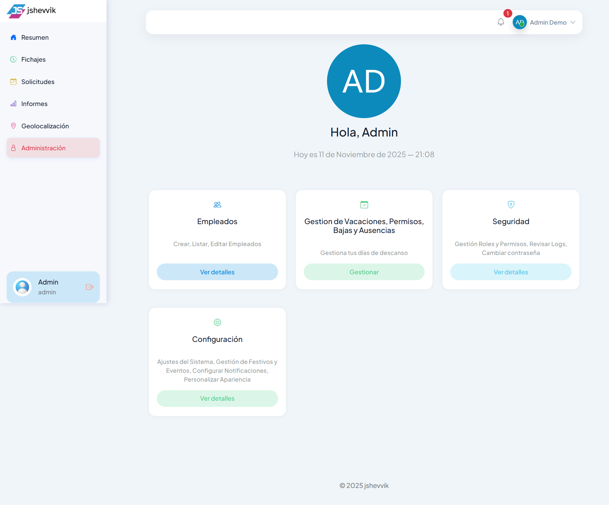
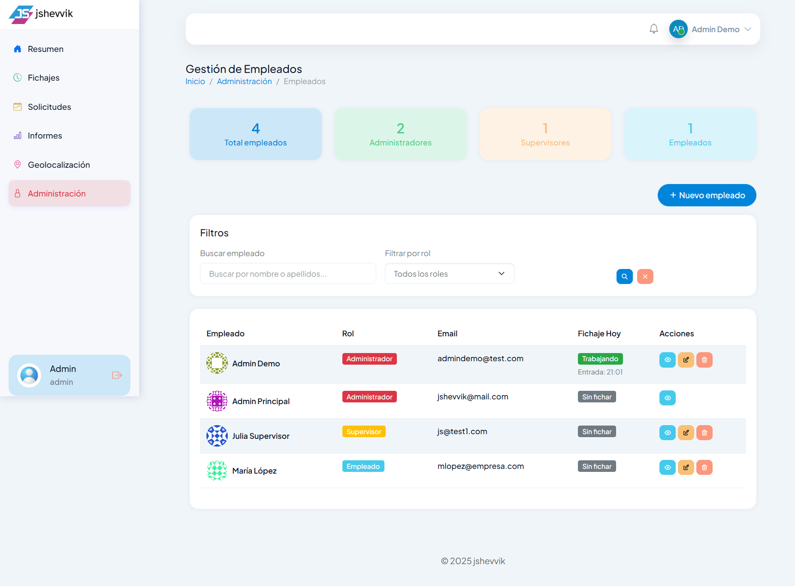
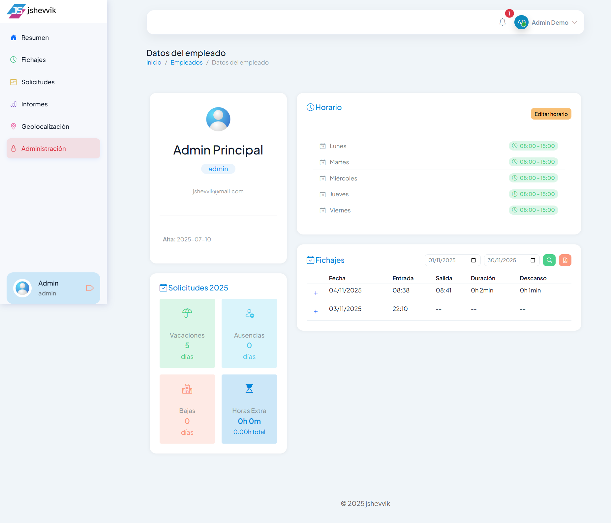
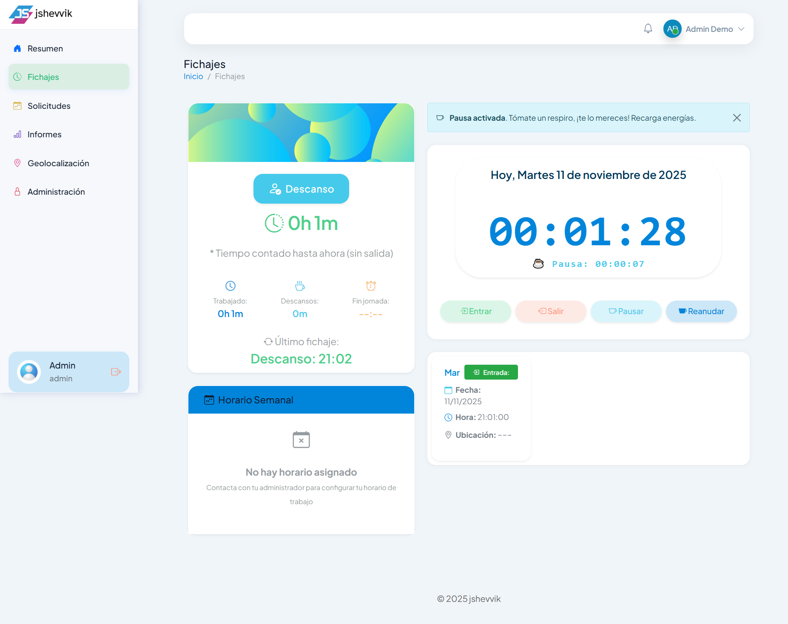
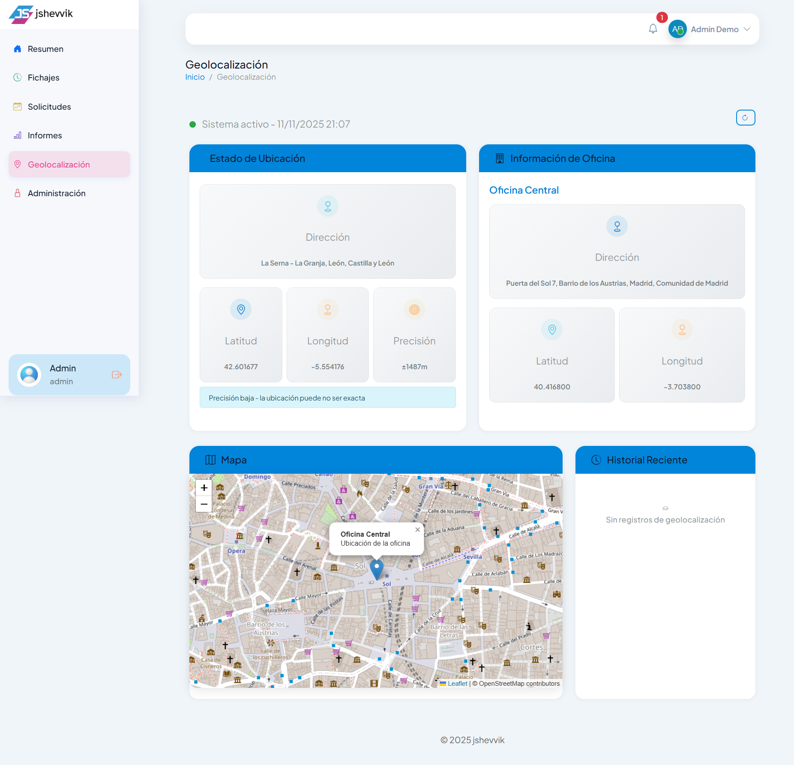
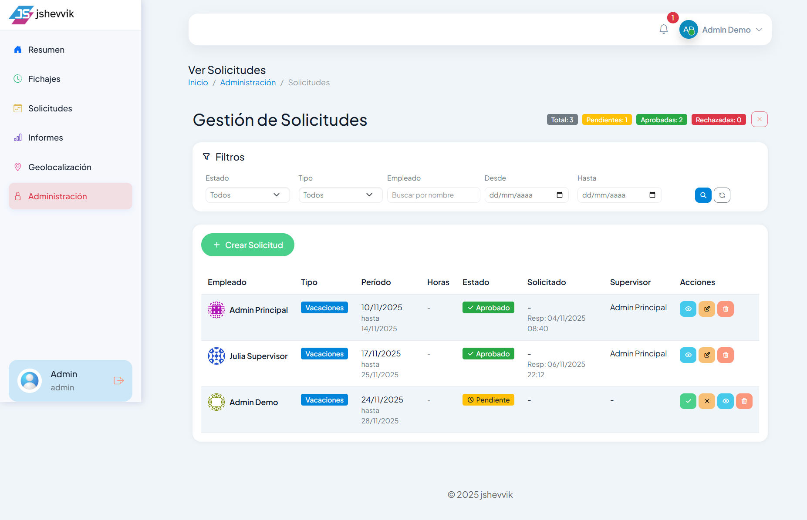
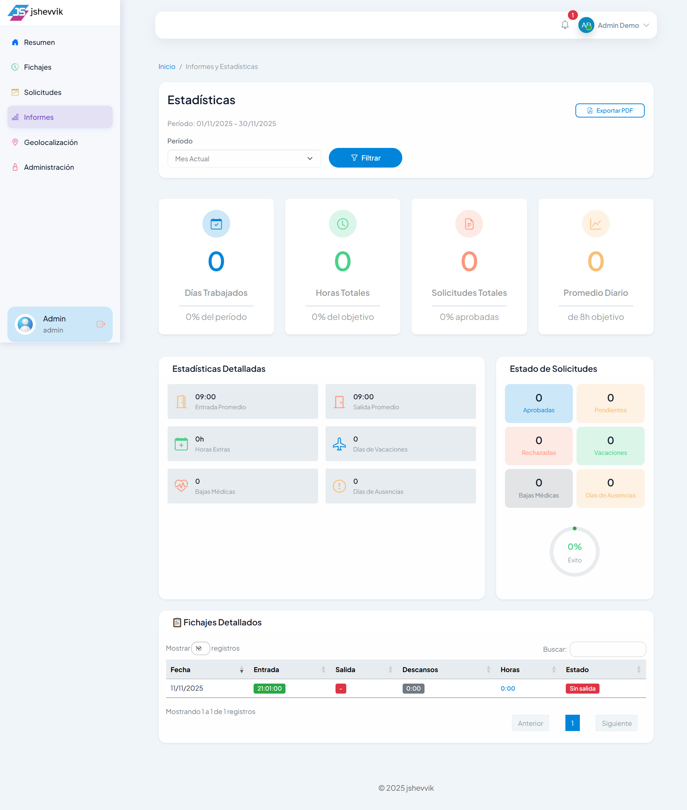
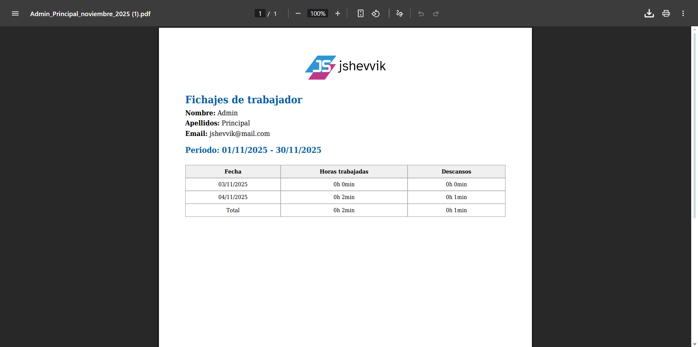

# 🕒 Control Horario — Sistema de Fichajes y Asistencia

[](https://www.php.net/)
[](https://www.mysql.com/)
[](https://railway.app/)
[](https://render.com/)

Aplicación para **gestión de horarios laborales**, fichaje con **geolocalización**, **solicitudes** (vacaciones/permiso/baja), **informes** en PDF y **panel administrativo**.

**🌐 Demo en vivo:** https://controlhorario-demo.onrender.com  
**💾 Base de datos:** MySQL 8.0+ en Railway

---

## 🔑 Credenciales de Prueba

Para probar la aplicación en la demo, usa estas credenciales:

| Rol | Usuario | Contraseña | Descripción |
|-----|---------|------------|-------------|
| 👑 **Admin** | `admindemo` | `admin123` | Acceso completo al sistema |
| 👥 **Supervisor** | `supervisor` | `supervisor123` | Gestión de empleados y aprobaciones |
| 👤 **Empleado** | `empleado` | `empleado123` | Fichaje y solicitudes |

> ⚠️ **Nota:** Estas son credenciales de demostración. En producción, cambia todas las contraseñas.

---

## 📸 Capturas de Pantalla

### 🏠 Dashboard Principal

*Panel principal con resumen de actividad, fichajes del día y accesos rápidos a las funcionalidades principales del sistema.*

---

### 👨‍💼 Panel de Administración

*Centro de control administrativo con acceso a gestión de empleados, solicitudes, configuración y seguridad.*

---

### 👥 Gestión de Empleados

*Lista completa de empleados con búsqueda, filtros por rol, estado de fichaje en tiempo real y acciones rápidas de edición.*

---

### 👤 Perfil de Empleado

*Vista detallada del empleado con información personal, horario asignado, historial de fichajes y opciones de gestión de permisos.*

---

### 📍 Fichaje con Geolocalización

*Sistema de fichaje inteligente con validación de ubicación mediante mapa interactivo (Leaflet), garantizando que los empleados fichen desde las ubicaciones autorizadas.*

---

### 🗺️ Configuración de Geolocalización

*Panel de configuración de ubicaciones permitidas para fichaje, con mapa interactivo para definir zonas autorizadas y radio de tolerancia.*

---

### 📋 Gestión de Solicitudes

*Administración de solicitudes de vacaciones, permisos y bajas con sistema de aprobación/rechazo, historial completo y notificaciones automáticas.*

---

### 📊 Estadísticas e Informes

*Dashboard de analíticas con gráficos de asistencia, horas trabajadas, ausencias y estadísticas por departamento o empleado.*

---

### 📄 Informes PDF

*Generación automática de informes de fichajes en formato PDF con filtros por período, empleado y tipo de reporte. Incluye resumen de horas trabajadas y descansos.*

---

## 📑 Índice
- [Credenciales de Prueba](#-credenciales-de-prueba)
- [Capturas de Pantalla](#-capturas-de-pantalla)
- [Características](#-características)
- [Stack](#-stack)
- [Estructura](#-estructura)
- [Instalación Local](#-instalación-local)
- [Despliegue en Render](#-despliegue-en-render)
- [Uso](#-uso)
- [Seguridad](#-seguridad)
- [Desarrollo](#-desarrollo)
- [Troubleshooting](#-troubleshooting)
- [Licencia](#-licencia)
- [Autor](#-autor)

---

## ✨ Características

### 🎯 Funcionalidades Principales

#### 👤 Gestión de Empleados
- ✅ CRUD completo de empleados (Crear, Leer, Actualizar, Eliminar)
- ✅ Asignación de roles: **Admin**, **Supervisor**, **Empleado**
- ✅ Sistema de **Super Admin** protegido (no puede ser eliminado ni editado)
- ✅ Gestión de horarios personalizados por empleado
- ✅ Permisos granulares por empleado (12 tipos de permisos)
- ✅ Avatar personalizado o generado automáticamente con iniciales
- ✅ Búsqueda y filtrado avanzado

#### 🕐 Sistema de Fichaje
- ✅ Fichaje de **Entrada/Salida** con marca de tiempo
- ✅ Control de **Pausas** (inicio y fin)
- ✅ Validación de ubicación mediante **geolocalización**
- ✅ Mapa interactivo (Leaflet) con zonas autorizadas
- ✅ Radio de tolerancia configurable
- ✅ Historial completo de fichajes
- ✅ Cálculo automático de horas trabajadas y descansos

#### 📋 Solicitudes
- ✅ Tipos: **Vacaciones**, **Permisos**, **Bajas**, **Ausencias**
- ✅ Sistema de aprobación/rechazo por admin/supervisor
- ✅ Historial de cambios con auditoría (quién modificó, cuándo, qué)
- ✅ Notificaciones automáticas al empleado
- ✅ Gestión de balances de días disponibles
- ✅ Validación de conflictos de fechas

#### 📊 Informes y Analíticas
- ✅ Generación de **PDF** con informes de fichajes (mPDF)
- ✅ Filtros por período, empleado y tipo
- ✅ Resumen de horas trabajadas y descansos
- ✅ Dashboard con estadísticas en tiempo real

#### 🔐 Seguridad
- ✅ Autenticación con **password_hash()** de PHP (bcrypt por defecto)
- ✅ Sesiones seguras con cookies HTTP-only
- ✅ Validación y sanitización de inputs
- ✅ **PDO** con prepared statements (anti SQL injection)
- ✅ Auditoría de acciones administrativas
- ✅ Protección de rutas según rol
- ✅ Sistema de Super Admin protegido

#### 🔔 Notificaciones
- ✅ Sistema de notificaciones internas
- ✅ Contador en tiempo real
- ✅ Notificaciones de solicitudes aprobadas/rechazadas
- ✅ Alertas de cambios importantes

#### 🎨 Interfaz
- ✅ Diseño **responsive** (Bootstrap 5.3)
- ✅ Iconos modernos (Bootstrap Icons, Tabler Icons)
- ✅ Datatables para listados avanzados
- ✅ Experiencia de usuario optimizada
- ✅ Diseño moderno y profesional

---

## 🧰 Stack
| Componente | Tecnología |
|-----------|------------|
| Backend | PHP 8.2 + Apache |
| Base de datos | MySQL 8.0+ (Railway) |
| Frontend | HTML5, Bootstrap 5, JS |
| Mapas | Leaflet 1.9.4 |
| PDF | mPDF 8.2 |
| Deploy App | Docker + Render |
| Deploy DB | Railway |
| Dependencias | Composer |

---

## 📦 Estructura
```
controlhorario_demo/
├── public/
│   ├── index.php
│   ├── login.php
│   ├── dashboard.php
│   ├── admin/
│   ├── acciones/
│   ├── fichaje/
│   ├── notificaciones/
│   ├── assets/
│   └── uploads/
├── includes/
│   ├── init.php
│   └── funciones.php
├── bin/
│   ├── configurar-sistema.php
│   ├── configurar-geolocalizacion.php
│   └── update-holidays.php
├── config.example.php
├── composer.json
├── Dockerfile
└── README.md
```

---

## 💻 Instalación Local

**Requisitos:** PHP 8.2+, MySQL 8.0+, Composer, Git

```bash
git clone https://github.com/jshevvik/controlhorario_demo.git
cd controlhorario_demo
composer install
cp config.example.php config.php
nano config.php
php bin/configurar-sistema.php
php bin/configurar-geolocalizacion.php
php -S localhost:8000 -t public
```

Abrir: http://localhost:8000

---

## 🌐 Despliegue en Render

### Base de Datos en Railway

1. Crea cuenta en https://railway.app
2. **New Project** → **Provision MySQL**
3. Obtén las credenciales en **Variables**:
   - `MYSQLHOST`
   - `MYSQLPORT` (normalmente 3306)
   - `MYSQLDATABASE`
   - `MYSQLUSER`
   - `MYSQLPASSWORD`

4. La base de datos se creará automáticamente al ejecutar el script de configuración:
```bash
# Conectarse al servidor Railway y ejecutar el script de configuración
php bin/configurar-sistema.php
```

> **Nota:** El script `configurar-sistema.php` creará todas las tablas necesarias automáticamente.

### Aplicación en Render

1. Conecta el repo en https://render.com  
2. Render detecta el **Dockerfile** automáticamente  
3. Configura variables de entorno con las credenciales de Railway:

```env
DB_HOST=tu-host-railway.railway.app
DB_NAME=railway
DB_USER=root
DB_PASS=tu_contraseña_railway
DB_PORT=3306
BASE_URL=https://tu-app.onrender.com/
UPLOADS_DIR=/var/www/html/public/uploads/usuarios/
APP_ENV=production
```

4. Ejecuta scripts de configuración inicial:
```bash
php bin/configurar-sistema.php
php bin/configurar-geolocalizacion.php
```

---

## 🧭 Uso

- `/login` → Inicio de sesión  
- Dashboard → Fichar entrada/salida  
- Solicitudes → Vacaciones, permisos, bajas  
- Informes → Generación PDF

---

## 🔐 Seguridad
- Contraseñas con **password_hash()** (bcrypt por defecto)
- **PDO** + prepared statements (prevención de SQL injection)
- Sesiones seguras con cookies HTTP-only
- Validación y sanitización de inputs
- Protección de rutas según rol
- Sistema de Super Admin protegido
- Auditoría de acciones administrativas

---

## 🛠️ Desarrollo

### Funciones principales
```php
require_once __DIR__ . '/../includes/init.php';
requireLogin();
requireAdminOrSupervisor();
getEmpleado();
obtenerGeoConfigEmpleado($id);
registrarLogin($usuario, $id, true);
getNotificaciones($id);
```

### Respaldo de Base de Datos (Railway)
```bash
# Exportar base de datos
mysqldump -h MYSQLHOST -P MYSQLPORT -u MYSQLUSER -p MYSQLDATABASE > backup.sql

# Importar base de datos
mysql -h MYSQLHOST -P MYSQLPORT -u MYSQLUSER -p MYSQLDATABASE < backup.sql
```

### Scripts de mantenimiento
```bash
# Actualizar festivos
php bin/update-holidays.php

# Configurar geolocalización
php bin/configurar-geolocalizacion.php

# Configurar sistema
php bin/configurar-sistema.php
```

---

## 🧯 Troubleshooting

**404 en rutas**
```bash
a2enmod rewrite && systemctl reload apache2
```

**Conexión BD**
- Verifica variables de entorno en Render
- Confirma que Railway DB esté activo
- Verifica que el IP de Render esté permitido en Railway
- Prueba conexión: `php -r "new PDO('mysql:host=HOST;port=3306;dbname=DB', 'USER', 'PASS');"`

**Permisos uploads**
```bash
chmod 755 public/uploads public/uploads/usuarios
chown -R www-data:www-data public/uploads
```

**Geolocalización**
```bash
php bin/configurar-geolocalizacion.php
```

**Railway Database timeout**
- Railway puede suspender la BD por inactividad (plan gratuito)
- Solución: Acceder a Railway Dashboard para despertar la BD
- Considera plan de pago para BD siempre activa

---

## 📜 Licencia
Proyecto de código abierto. Puedes usar, modificar y distribuir este código libremente.

---

## 👤 Autor
**jshevvik** — https://github.com/jshevvik  
Versión **1.1.0** · Noviembre 2025
